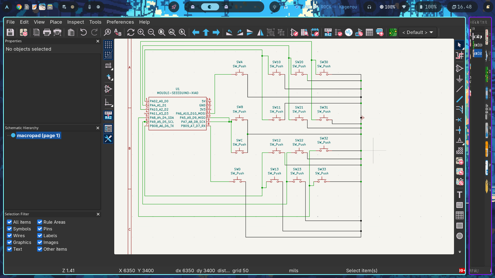
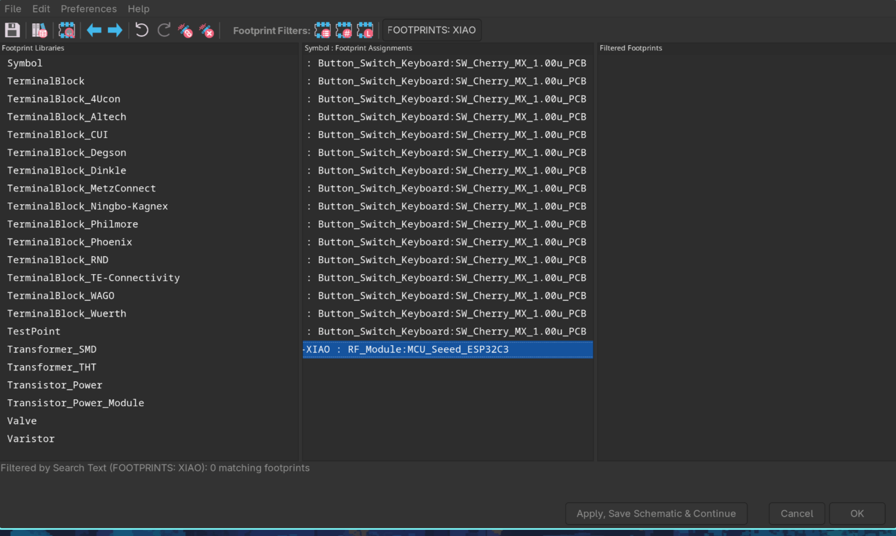
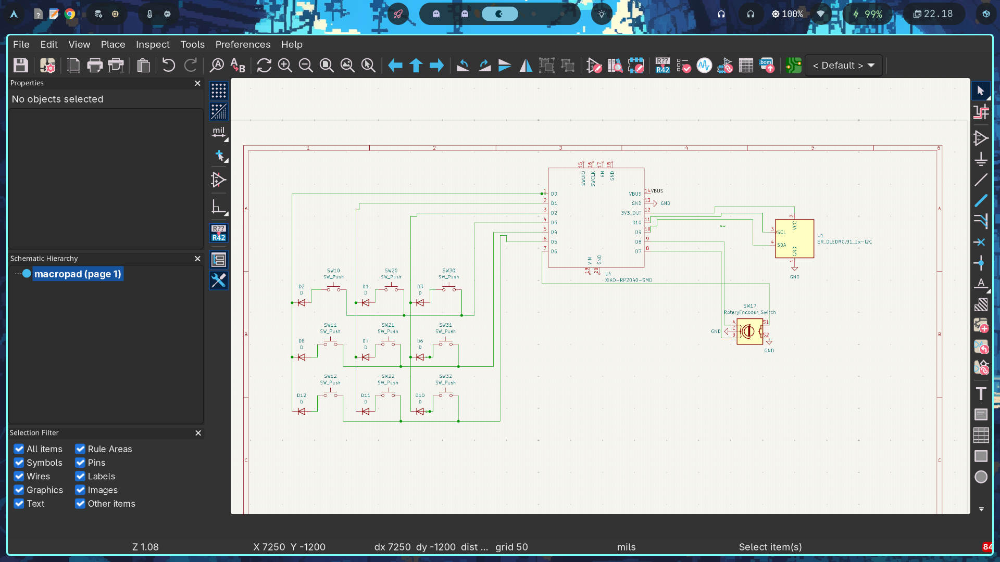
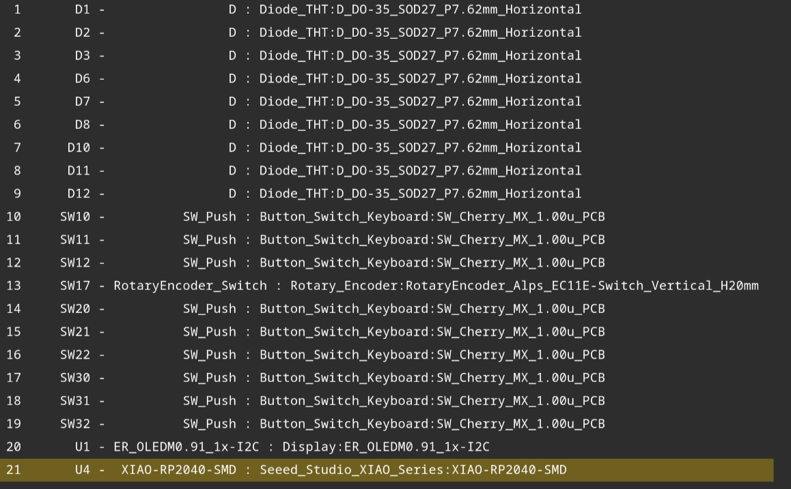
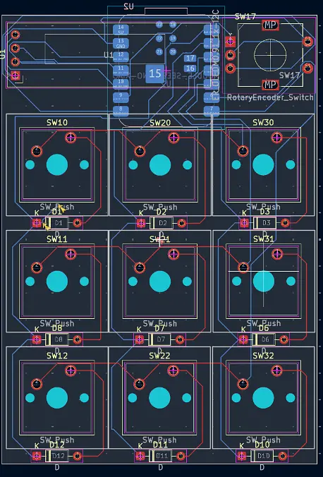

# August 16th: <Designing my PCB>

After discovering stardance yesterday I started my project (I'm a complete newby in hardware).

I tried to record it with lapse but it had some issues. 

I've spent 2 h doing the PCB design and the footprints, including the research.
it costed me to find the right pages to look how to configure KiCad myself (the names are a bit different from the hackpad tutorial) the pages were:

https://hackpad.hackclub.com/
https://github.com/Seeed-Studio/OPL_Kicad_Library/tree/master/Seeed%20Studio%20Wio%20LR1121%20Module%20v0.9
https://github.com/Seeed-Studio/OPL_Kicad_Library/tree/master/Seeed%20Studio%20Wio%20LR1121%20Module%20v0.9
https://wiki.seeedstudio.com/Seeeduino-XIAO/
https://github.com/Anderson69s/SeeedStudio-Xiao-KiCAD

The lapse app stopped recording several times, so it shows half the time I have spent on the project.
Tomorrow I will be enhancing these things.

**Total time spent: 2h**
# August 17th: <Designing my PCB.2>

I was looking for other designs to see how to include a rotary encoder and a screen, but I've realized that my reasoning about the pin connections and the keys was incorrect, so I implemented a matrix and reduced the number of keys to 9. I have also changed the controller to the actual one (Seeed XIAO RP2040)

Research:
https://wiki.seeedstudio.com/XIAO-RP2040/
https://www.reddit.com/r/KiCad/comments/j1lceg/footprint_for_ec11_rotary_encoder_wswitch/
https://github.com/gutbag/xiao_rp2040
https://www.reddit.com/r/KiCad/comments/1pjn5wh/macropad_help/
https://hackpad.hackclub.com

This time I could record everything.
I spent like an hour to do this while searching and a half in assigning the new footprints (I know it is too much but I could not find the libraries)

**Total time spent: 1.5h**
# August 17th: <Designing my PCB.3>
Today it went very well, the instructions on hackpad were very illustrative and I could design my PCB routing with no problems, well, I was confused at first but, after a hour of trial and error and because it seemed kind off messed up, I was near 2.5 h working on it, but I'm satisfied.

**Total time spent: 2.5h**
